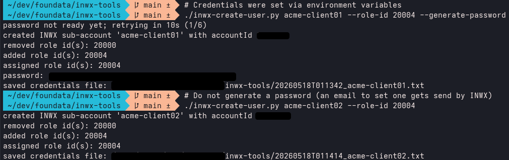

# INWX Tools

Helper scripts and tools to administer, provision and/or manage tasks related to [INWX](https://www.inwx.de/), a well known professional domain provider.


<div align="center" id="project-readme-header">
<br>
<br>

**⭐ Found this useful? Support open-source and star this project:**

[](https://github.com/foundata/inwx-tools)

<br>
</div>


## Table of contents<a id="toc"></a>

- [`inwx-create-user.py`](#inwx-create-user)


## `inwx-create-user.py`<a id="inwx-create-user"></a>

**Helper to *quickly* create additional sub-user accounts.**

Creates a sub-user account with parent account contact data as default, and optionally grants [INWX roles](https://account.inwx.de/en/help/apidoc/f/ch02.html#account.addrole):



```
./inwx-create-user.py --help
usage: inwx-create-user.py [-h] [--ote] [--api-url API_URL] [--language LANGUAGE] [--debug] [--json] [--no-output-file]
                           [--password [PASSWORD]] [--generate-password] [--password-retries PASSWORD_RETRIES]
                           [--password-retry-delay PASSWORD_RETRY_DELAY] [--require-2fa] [--role-id ROLE_ID] [--keep-full-access]
                           [--email EMAIL] [--title TITLE] [--firstname FIRSTNAME] [--lastname LASTNAME] [--street STREET] [--pc PC]
                           [--city CITY] [--cc CC] [--org ORG] [--voice VOICE]
                           username

Create an INWX sub-account and optionally grant roles.

positional arguments:
  username              Username for the INWX sub-account to create.

options:
  -h, --help            show this help message and exit
  --ote                 Use the INWX OT&E test API. Default is production.
  --api-url API_URL     Override API base URL, for example https://api.ote.domrobot.com.
  --language LANGUAGE   INWX language code. Default: EN.
  --debug               Print redacted XML-RPC call metadata to stderr.
  --json                Print machine-readable result JSON.
  --no-output-file      Do not write the created sub-user credentials file next to this script.
  --password [PASSWORD]
                        Password for the new sub-account. If used without a value, prompt securely.
  --generate-password   Generate and set a password for the new sub-account.
  --password-retries PASSWORD_RETRIES
                        Retries for the initial password change after account.create. Default: 6.
  --password-retry-delay PASSWORD_RETRY_DELAY
                        Seconds between initial password change retries. Default: 10.
  --require-2fa         Set required2fa=1 for the sub-account.
  --role-id ROLE_ID     Role id to assign. Repeatable. 20000 (Full Access), 20001 (Accounting), 20002 (Domain), 20003 (Hosting), 20004
                        (DNS), 20005 (Authcodes)
  --keep-full-access    Keep INWX's default Full Access role. By default, Full Access is removed unless --role-id 20000 is explicitly
                        requested.
  --email EMAIL         Sub-account email. Defaults to parent email.
  --title TITLE         Sub-account title. Defaults to parent title.
  --firstname FIRSTNAME
                        Sub-account first name. Defaults to parent first name.
  --lastname LASTNAME   Sub-account last name. Defaults to parent last name.
  --street STREET       Sub-account street. Defaults to parent street.
  --pc PC               Sub-account postal code. Defaults to parent postal code.
  --city CITY           Sub-account city. Defaults to parent city.
  --cc CC               Sub-account country code. Defaults to parent country code.
  --org ORG             Sub-account organization. Defaults to parent organization.
  --voice VOICE         Sub-account phone number. Defaults to parent phone number.
```

### Usage notes

API credentials are read from environment variables. If a variable is missing, the script prompts for it interactively:

```sh
export INWX_API_USER='...'
export INWX_API_PASSWORD='...'
export INWX_API_OTPSECRET='...' # optional unless the account requires 2FA
```

By default the script uses the production INWX API. Pass `--ote` for the [INWX OT&E](https://ote.inwx.com/de) test API.

```sh
./inwx-create-user.py new-example-user --generate-password --role-id 20004
./inwx-create-user.py new-example-user --ote --generate-password --role-id 20001 --role-id 20004
./inwx-create-user.py new-example-user --password
```

INWX creates sub-users with Full Access (`20000`) by default; this helper removes that role unless you explicitly pass `--role-id 20000` or `--keep-full-access`. For [ACME DNS-01](https://letsencrypt.org/docs/challenge-types/#dns-01-challenge) clients, pass `--role-id 20004` to grant the DNS role to manage DNS resource records:

```sh
./inwx-create-user.py acme-client-example --role-id 20004
```

The helper copies the parent account contact data from `account.info` and uses it for the required `account.create` fields. Override individual fields when needed:

```sh
./inwx-create-user.py acme-example \
  --email "acme-admin@example.org" \
  --firstname "ACME" \
  --lastname "Automation" \
  --generate-password
```

For machine-readable output:

```sh
./inwx-create-user.py acme-example --generate-password --json
```

By default the script stores the created sub-user details next to the script as `YYYYMMDDTHHMMSS_username.txt` with file mode `0600`. The file contains the created account id, role ids, and the `INWX_API_USER` / `INWX_API_PASSWORD` values for the sub-user when a password was set or generated. Disable that file with:

```sh
./inwx-create-user.py acme-example --generate-password --no-output-file
```

**Important note on deleting users:** As of 2026-Q2, user accounts cannot be fully deleted by the customer. When a user is created and later deleted via the Web UI or API, a new user with the same username cannot be created again afterwards, as the system will return `code 2302: Object exists`.<br> Deleting a user therefore only makes the account invisible and deactivates it; the user object still remains in the system. If the same username is absolutely required again, INWX Support must be contacted.


## Licensing, copyright<a id="licensing-copyright"></a>

<!--REUSE-IgnoreStart-->
Copyright (c) 2026 [foundata GmbH](https://foundata.com/) (https://foundata.com)

This project is licensed under the GNU General Public License v3.0 or later (SPDX-License-Identifier: `GPL-3.0-or-later`), see [`LICENSES/GPL-3.0-or-later.txt`](./LICENSES/GPL-3.0-or-later.txt) for the full text.

The [`REUSE.toml`](./REUSE.toml) file provides detailed licensing and copyright information in a human- and machine-readable format. This includes parts that may be subject to different licensing or usage terms, such as third-party components. The repository conforms to the [REUSE specification](https://reuse.software/spec/). You can use [`reuse spdx`](https://reuse.readthedocs.io/en/latest/readme.html#cli) to create a [SPDX software bill of materials (SBOM)](https://en.wikipedia.org/wiki/Software_Package_Data_Exchange).
<!--REUSE-IgnoreEnd-->

[](https://api.reuse.software/info/github.com/foundata/inwx-tools)


### Trademarks<a id="trademarks"></a>

* [INWX® is a trademark](https://register.dpma.de/DPMAregister/marke/registerhabm?AKZ=018729512) of INWX GmbH, registered Germany and probably other countries.


## Author information<a id="author-information"></a>

This project was created and is maintained by [foundata](https://foundata.com/). If you like it, you might [buy us a coffee](https://buy-me-a.coffee/inwx-tools/).

The INWX Tools project is *not* associated with [INWX](https://www.inwx.de/).
